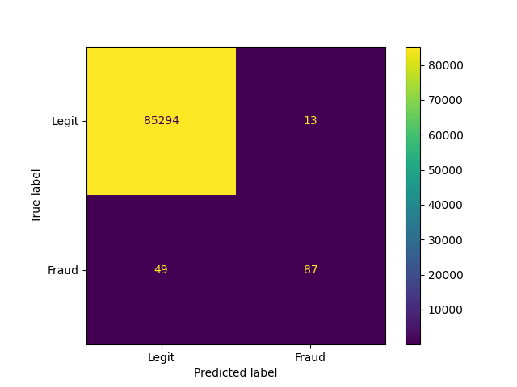
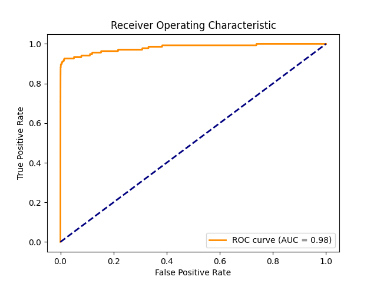

# Fraud Detection System
machine learning system for detecting fraudulent credit card transactions using logistic regression and data visualization.

# FEATURES
- Data preprocessing
- Model training
- Performance charts. Confusion matrix and performance metrics

# REQUIREMENTS
- Python
- pandas, scikit-learn, matplotlib

## DATASET
The Dtaset was too large to be uploaded on github
you can download it from kaggle 
Download it from [Kaggle – Credit Card Fraud Detection](https://www.kaggle.com/datasets/mlg-ulb/creditcardfraud)

### VISUALS (Charts) 
See Figure_1.png and Figure_2.png for model visualisation

###  Output

### Confusion Matrix

### Accuracy and Loss

